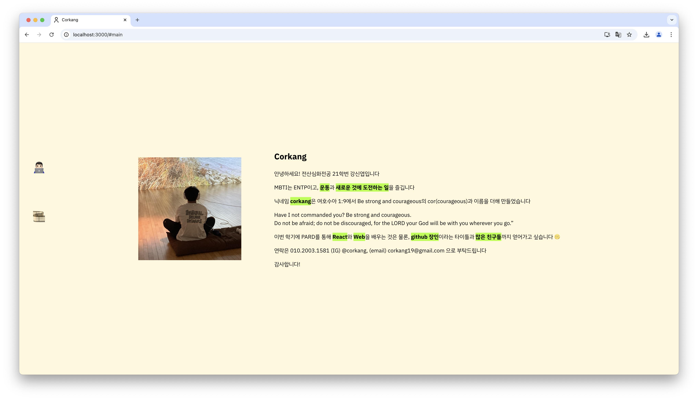
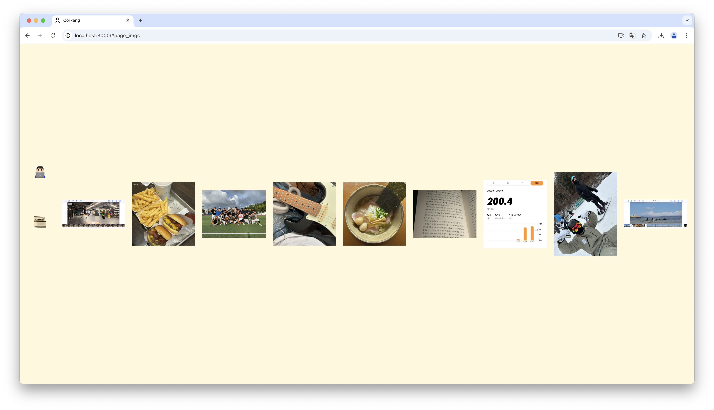

# [OT 과제] 자기소개 페이지 👤

## Overview 👀
React를 사용해 자기소개 페이지 만들어보기. 형식과 분량은 자유.

react의 구조를 파악하고, 문법을 공부해볼 수 있었다.

<br>

## Building ⚙️
1. Repository 클론
```shell
git clone https://github.com/4th-PARD-WEB-PART/KangShinyeob.git
```

2. package 다운받기
```shell
npm install
```

3. 프로젝트 실행
```shell
npm start
```
<br>

## Screenshot 📷




## References 🤩
- [Toy project | 자기소개 페이지 만들기 by Saemsol Yoo](https://velog.io/@saemsol/my-first-page)
- [TIL 07 | 자기소개 페이지 만들기 리뷰 by meow](https://velog.io/@hyounglee/TIL-07)